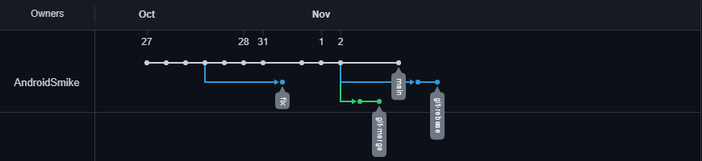
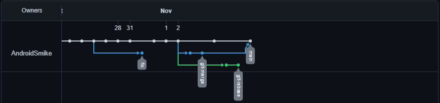
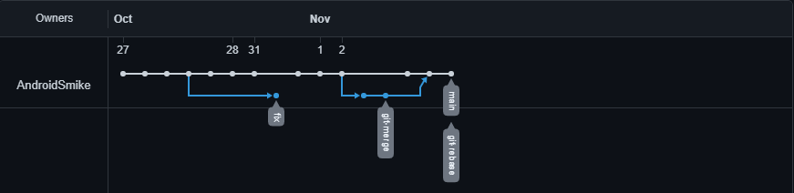

# devops-netology Сергей Леонов

## Задание №1 – Ветвление, merge и rebase.
___
## 1. Подготовка
Для лучшей структуризации рабочего репозитория каталог `branching` был создан в каталоге `02-git-03-branching`. 
Внутри каталога созданы файлы `merge.sh` и `rebase.sh` с содержимым:
```bash
#!/bin/bash
# display command line options
count=1
for param in "$*"; do
    echo "\$* Parameter #$count = $param"
    count=$(( $count + 1 ))
done
```
Файлы отправлены в коммит с описанием `prepare for merge and rebase`
___

## 2. Подготовка файла `merge.sh`

* Создал ветку `git-merge` с помощью команды `checkout -b [name brach]`. Внес изменения в файл `merge.sh`, 
а именно заменил * на @. 
Создал коммит с названием `merge: @instead *` и запушил его в github c помощью команды `git push origin git-merge`.

* Внес изменения в файл `merge.sh` и создал коммит с названием `merge: use shift` и запушил его в github c помощью 
команды `git push origin git-merge`.
___
## 3. Изменение ветки `main`
* Переключился на ветку `main` и отредактировал файл `rebase.sh`. Добавил в коммит `main: edit rebase.sh` и запушил 
его с `git push origin main`.
___

## 4. Подготовка файла `rebase.sh`
* Переключился на коммит `prepare for merge and rebase` и создал ветку `git-rebase`. Использовал команду `git switch -c
[name branch]`
* Внес изменения в `rebase.sh` и запушил коммит `git rebase 1`
* Внес изменения в `rebase.sh` и запушил коммит `git rebase 2`
___
## Промежуточный итог 

 </br>
Так выглядит вкладка `network` в github после выполнения всех описанных действий. Ветка `fix` осталась после предыдущих
домашних работ.
___
## 5. Merge 
* Переключился на ветку `main` и произвел слияние с веткой `git-merge` с помощью команды `git merge git-merge`.

 </br>
___

## 6. Rebase
* Переключаюсь на ветку `git-rebase` и выполняю `git rebase -i main` `-i` - интерактивный режим, где использую следующие
комманды. 
```bash
pick 8786710 git-rebase 1
fixup 999dcbd git-rebase 2
```

В ходе исправлений конфликтов, во время применения второго коммита по случайности оставил не ту часть, что просили в 
задании, однако конфликт исправил верно и rebase прошел успешно создав коммит `git-rebase use`.
* После этого пушим данный коммит в ветку `git-rebase` с флагом `-f`, так как изменялась история (вместо двух коммитов стал 1)
* Переключаемся на ветку `main` и мержем ветку `git rebase`
По итогу моя вкладка `network ` выглядит так:


___
